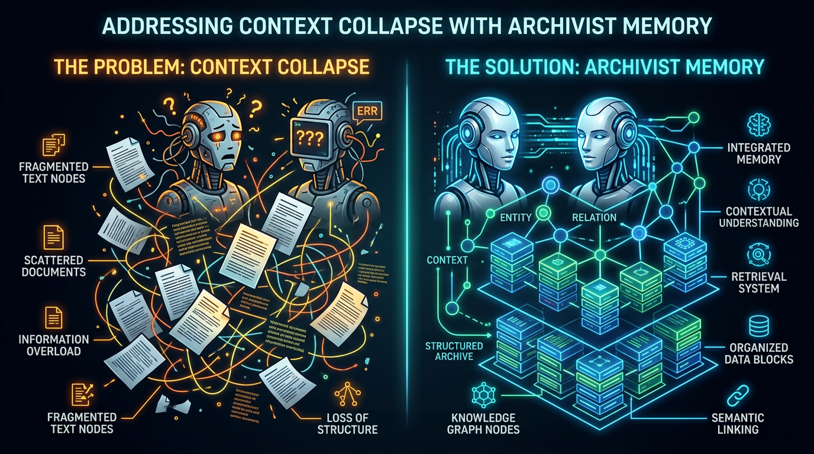
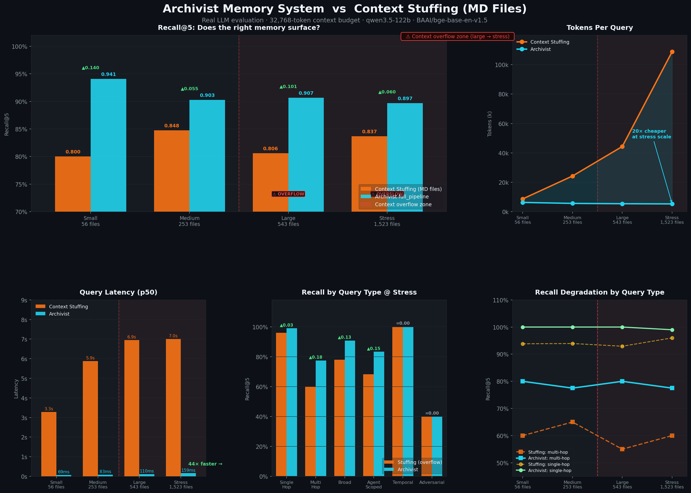
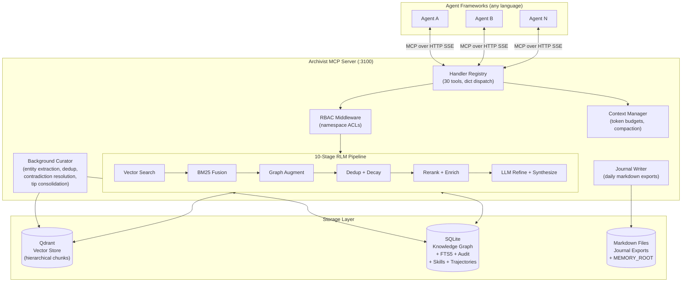

<p align="center">
  
</p>

<h1 align="center">Archivist</h1>
<p align="center"><strong>Memory-as-a-Service for AI agent fleets.</strong><br>
Vector search + knowledge graph + active curation — one MCP endpoint.</p>

<p align="center">
  <a href="#quick-start"><strong>Quick Start</strong></a> · <a href="#how-it-works"><strong>How It Works</strong></a> · <a href="#benchmarks"><strong>Benchmarks</strong></a> · <a href="#mcp-tools-30"><strong>30 MCP Tools</strong></a> · <a href="#configuration-reference"><strong>Config</strong></a> · <a href="#architecture-deep-dive"><strong>Architecture</strong></a> · <a href="docs/ROADMAP.md"><strong>Roadmap</strong></a>
</p>

<p align="center">
  
  
  
  
</p>

---

## TL;DR

```bash
git clone https://github.com/NetworkBuild3r/archivist-oss.git
cd archivist-oss && cp .env.example .env   # set LLM + embed (see docs/DOCKER.md for xAI + host vLLM)
docker compose up -d --build               # Archivist :3100 + Qdrant :6333
curl http://localhost:3100/health          # {"status":"ok"}
```

Full Docker options (host vLLM, `/opt/appdata` volumes, overrides): [`docs/DOCKER.md`](docs/DOCKER.md).

Point any MCP client at `http://localhost:3100/mcp/sse` — done. Your agents now have long-term memory with search, RBAC, knowledge graphs, and active curation out of the box.

---

## The Problem

AI agents are amnesiacs. Every session starts from scratch. Teams building multi-agent systems hit three walls:

<p align="center">
  
</p>

| Wall | What happens | What Archivist does |
|------|-------------|---------------------|
| **Context collapse** | Standard RAG throws top-k chunks until the token limit blows up | Active token budget tracking, tiered summaries (L0/L1/L2), structured compaction |
| **Multi-agent chaos** | Agents overwrite each other's memories, hallucinate conflicting facts | Namespace RBAC, conflict detection, contradiction surfacing, LLM-adjudicated dedup |
| **Passive storage** | Databases sit idle until queried | Background curator extracts entities, resolves contradictions, compresses stale memories, exports daily journals |

---

## How It Works

Archivist combines three storage backends behind a single MCP endpoint:

| Layer | Tech | Purpose |
|-------|------|---------|
| **Vector store** | Qdrant | Semantic similarity search over hierarchical chunks |
| **Knowledge graph** | SQLite | Entity-relationship-fact triples with temporal tracking |
| **Keyword index** | SQLite FTS5 | BM25 full-text search fused with vector results |
| **File system** | Markdown | Human-readable journal exports, file-watched ingestion |

Every query flows through a **10-stage RLM (Recursive Layered Memory) pipeline:**

```
Query → Vector Search → BM25 Fusion → Graph Augmentation → Dedup
  → Temporal Decay → Hotness Scoring → Threshold Filter → Rerank
    → Parent Enrichment → Context Budget → LLM Refinement → Synthesis
```

Each stage is observable via `retrieval_trace` in every response.

---

## Why Archivist

| Feature | Archivist | Vanilla vector DB | Typical RAG |
|---------|-----------|-------------------|-------------|
| Multi-agent RBAC | Namespace-level read/write ACLs | No | No |
| Knowledge graph | Entity-relationship-fact with multi-hop traversal | No | No |
| Hybrid search | Vector + BM25 weighted fusion | Vector only | Vector only |
| Active curation | Background entity extraction, contradiction resolution, stale compression | No | No |
| Context management | Token budgets, tiered summaries, structured compaction | No | No |
| Trajectory learning | Outcome-aware retrieval scoring from past successes/failures | No | No |
| Skill registry | Track tool health, failure modes, substitutes | No | No |
| Observability | Prometheus metrics, retrieval traces, health dashboard | Varies | No |
| Protocol | MCP (language-agnostic) | Client library | Framework-specific |
| Deployment | `docker compose up` | DIY | DIY |

---

## Benchmarks

Live run (2026-04-06) — **Qdrant** vector store, **`BAAI/bge-base-en-v1.5`** embeddings (local), **`qwen3.5-122b`** via LiteLLM over Tailscale. Four corpus scales (56 → 1,523 files), 107–110 questions per scale covering 8 query types. Context stuffing uses real LLM calls. All Archivist runs use `--no-refine` (pure retrieval, no generative synthesis). Context budget: **32,768 tokens** (realistic agent window after system prompt, history, and tools).

<p align="center">
  
</p>

### Scale Sweep: Recall vs Context Stuffing (MD Files)

| Scale | Files | Corpus Tokens | Fits in Window? | Stuffing Recall | Archivist Recall | Delta | Archivist Tok/Q | Stuffing p50 | Archivist p50 |
|-------|-------|--------------|-----------------|-----------------|-----------------|-------|-----------------|-------------|--------------|
| Small  | 56    | 8,681   | ✅ YES (27%)     | 80.0%  | **94.1%** | +14.1% | 6,302 | 3.3 s | **69 ms** |
| Medium | 253   | 24,262  | ✅ YES (74%)     | 84.8%  | **90.3%** | +5.5%  | 5,638 | 5.9 s | **83 ms** |
| Large  | 543   | 44,351  | ⚠️ OVERFLOW      | 80.6%  | **90.7%** | +10.1% | 5,423 | 6.9 s | **110 ms** |
| Stress | 1,523 | 108,847 | ⚠️ OVERFLOW      | 83.7%  | **89.7%** | +6.0%  | 5,293 | 7.0 s | **159 ms** |

**At stress scale: Archivist is 44× faster, uses 20× fewer tokens per query, and achieves 6% higher recall — with context that has completely overflowed stuffing.**

Archivist's token cost *decreases* slightly as the corpus grows (6,302 → 5,293 tok/q) because entity-anchored retrieval becomes more precise as the knowledge graph fills with facts. Stuffing's cost scales linearly with corpus size.

### Per-Query-Type Breakdown at Stress Scale (1,523 files, 100% overflow)

| Query Type | n | Stuffing Recall | Archivist Recall | Delta | Notes |
|------------|---|-----------------|-----------------|-------|-------|
| Single-hop | 50 | 96.0% | **99.0%** | +3.0% | Direct factual lookups |
| Multi-hop  | 10 | 60.0% | **77.5%** | +17.5% | Cross-document reasoning |
| Broad      | 30 | 77.9% | **90.8%** | +12.9% | Open-ended synthesis |
| Agent-scoped | 5 | 68.3% | **83.3%** | +15.0% | RBAC-filtered per-agent queries |
| Temporal   | 5  | 100.0% | 100.0% | = | Time-anchored lookups (both excel) |
| Adversarial | 5 | 40.0% | 40.0% | = | No ground truth — expected ceiling |
| Contradiction | 2 | 100.0% | 100.0% | = | Fact conflict detection |
| Needle     | 3 | 75.0% | 33.3% | −41.7% | Single rare fact; stuffing wins if doc survives truncation |

Multi-hop and broad synthesis are where Archivist's knowledge graph pays off most — these are exactly the queries that require connecting facts across many files, which stuffing handles poorly under overflow. The needle regression is real and honest: if a rare, single-document fact isn't tied to a known entity, entity injection doesn't help.

### What Each Pipeline Stage Does

| Stage | Purpose | When it matters |
|-------|---------|----------------|
| **Vector search** | Semantic similarity via embeddings | Baseline — handles most single-hop queries |
| **BM25 fusion** | Exact keyword matching merged with vector scores | Catches acronyms, error codes, and proper nouns that embeddings miss |
| **Graph augmentation** | Entity-relationship traversal from knowledge graph | Multi-hop queries: "which agents worked on X?" |
| **Entity injection** | Guarantees all known facts for detected entities are returned | Critical for agent-scoped, infrastructure, and person queries |
| **Temporal decay** | Exponential recency weighting | Prevents stale memories from crowding out recent decisions |
| **Hotness scoring** | Frequency × recency boost | Surfaces frequently-accessed memories (high signal) |
| **Reranking** | Cross-encoder reranking for precision | Tightens top-k ordering when precision matters more than recall |
| **Parent enrichment** | Expands child chunks to parent context | Provides surrounding context for better synthesis |
| **LLM refinement** | Generative synthesis of retrieved chunks | Produces coherent answers instead of raw chunk dumps |

### Features

| Feature | Archivist |
|---------|-----------|
| Hybrid search (vector + BM25) | Yes (0.7/0.3 fusion) |
| Temporal knowledge graph | Yes (SQLite + FTS5) |
| Active curation (background) | Yes (LLM dedup, tip consolidation) |
| Retention classes (pin/unpin) | Yes (ephemeral/standard/durable/permanent) |
| Entity-anchored retrieval | Yes (guaranteed recall for known entities) |
| Fact versioning (superseded_by) | Yes (auto-detects conflicting facts) |
| Multi-agent RBAC | Yes (namespace ACLs) |
| Cross-encoder reranking | Yes (BAAI/bge-reranker-v2-m3) |
| Hotness scoring | Yes (freq × recency) |
| Conflict detection | Yes (vector + LLM adjudication) |
| Self-hosted / Apache 2.0 | Yes |

> **Reproduce:** `docker compose --profile benchmark run --rm --entrypoint /bin/bash benchmark benchmarks/scripts/run_full_comparison.sh`
>
> Full reproduction steps, raw JSON outputs, and per-query-type breakdown: [`docs/BENCHMARKS.md`](docs/BENCHMARKS.md)

---

## Quick Start

### Prerequisites

- **Docker & Docker Compose** (that's it for running)
- An **OpenAI-compatible LLM API** — OpenAI, LiteLLM, Ollama, vLLM, or any `/v1/chat/completions` endpoint
- An **OpenAI-compatible embeddings API** — same providers, `/v1/embeddings` endpoint

### 1. Clone and configure

```bash
git clone https://github.com/NetworkBuild3r/archivist-oss.git
cd archivist-oss
cp .env.example .env
```

Edit `.env` with your endpoints:

```bash
LLM_URL=http://localhost:4000      # or https://api.openai.com/v1
LLM_MODEL=gpt-4o-mini
LLM_API_KEY=sk-...
EMBED_URL=http://localhost:4000    # or same as LLM_URL
EMBED_MODEL=text-embedding-3-small
VECTOR_DIM=1536                    # match your embedding model
```

### 2. Start services

```bash
docker compose up -d
```

This starts:
- **Archivist** on port `3100` (MCP server + REST admin)
- **Qdrant** on port `6333` (vector store)

### 3. Verify

```bash
curl http://localhost:3100/health
# {"status": "ok", "service": "archivist", "version": "1.0.0"}
```

### 4. Connect your agents

Point any MCP client at:
```
http://localhost:3100/mcp/sse
```

That's it. Your agents can now `archivist_store`, `archivist_search`, `archivist_recall`, and use all 30 tools.

### 5. Optional: add RBAC

Create `namespaces.yaml` (see [`namespaces.yaml.example`](namespaces.yaml.example)):

```yaml
namespaces:
  alice:
    readers: [alice, bob]
    writers: [alice]
  bob:
    readers: [bob]
    writers: [bob]
  shared:
    readers: [all]
    writers: [alice, bob]
```

Without it, Archivist runs in **permissive mode** — all agents can read/write everything. Fine for single-user or dev setups.

---

## MCP Tools (30)

### Search & Retrieval (7)

| Tool | What it does |
|------|-------------|
| `archivist_search` | Semantic search with 10-stage RLM pipeline. Fleet-wide, single-agent, or multi-agent. Supports `min_score`, `tier` (L0/L1/L2), `max_tokens`, date range, memory type filters. |
| `archivist_recall` | Multi-hop knowledge graph lookup — entities, relationships, facts |
| `archivist_timeline` | Chronological memory timeline for a topic |
| `archivist_insights` | Cross-agent knowledge discovery across namespaces |
| `archivist_deref` | Fetch full L2 text for a memory by ID (drill-down after compact search) |
| `archivist_index` | Compressed navigational index of a namespace (~500 tokens) |
| `archivist_contradictions` | Surface contradicting facts about an entity across agents |

### Storage & Memory Management (3)

| Tool | What it does |
|------|-------------|
| `archivist_store` | Write a memory with entity extraction, conflict checks, LLM-adjudicated dedup |
| `archivist_merge` | Merge conflicting memories (latest / concat / semantic / manual) |
| `archivist_compress` | Archive memories → compact summaries (flat or structured Goal/Progress/Decisions/Next Steps) |

### Trajectory & Feedback (5)

| Tool | What it does |
|------|-------------|
| `archivist_log_trajectory` | Log execution trajectory (task + actions + outcome), auto-extract tips |
| `archivist_annotate` | Add quality annotations (note, correction, stale, verified) |
| `archivist_rate` | Rate a memory as helpful (+1) or unhelpful (-1) |
| `archivist_tips` | Retrieve strategy/recovery/optimization tips from past trajectories |
| `archivist_session_end` | Summarize a session into durable memory |

### Skill Registry (6)

| Tool | What it does |
|------|-------------|
| `archivist_register_skill` | Register/update a skill (MCP tool) with provider, version, endpoint |
| `archivist_skill_event` | Log invocation outcome (success/partial/failure) for health scoring |
| `archivist_skill_lesson` | Record failure modes, workarounds, best practices |
| `archivist_skill_health` | Health grade, success rate, recent failures, substitutes |
| `archivist_skill_relate` | Create relations (similar_to, depend_on, compose_with, replaced_by) |
| `archivist_skill_dependencies` | Skill dependency/relation graph |

### Admin & Context Management (7)

| Tool | What it does |
|------|-------------|
| `archivist_context_check` | Pre-reasoning token counting against a budget with compaction hints |
| `archivist_namespaces` | List namespaces accessible to the calling agent |
| `archivist_audit_trail` | Immutable audit log of all memory operations |
| `archivist_resolve_uri` | Resolve `archivist://` URIs to underlying resources |
| `archivist_retrieval_logs` | Export/analyze retrieval pipeline execution traces |
| `archivist_health_dashboard` | Single-pane health: memory counts, stale %, conflict rate, skills, cache |
| `archivist_batch_heuristic` | Recommended batch size (1-10) from health signals |

### Cache Management (2)

| Tool | What it does |
|------|-------------|
| `archivist_cache_stats` | Hot cache stats: entries per agent, TTL, hit rate |
| `archivist_cache_invalidate` | Manual cache eviction by namespace, agent, or all |

> Full parameter schemas, types, defaults, and examples: [`docs/CURSOR_SKILL.md`](docs/CURSOR_SKILL.md)
> Condensed reference table: [`docs/REFERENCE.md`](docs/REFERENCE.md)

---

## Architecture Deep Dive



### Module Map (40+ Python modules)

The codebase is organized by domain:

| Package/Module | Responsibility |
|----------------|---------------|
| `main.py` | Starlette app, startup, background task management |
| `mcp_server.py` | Thin MCP orchestrator (~30 lines) → delegates to handlers |
| **`handlers/`** | |
| ↳ `_registry.py` | Central tool registry: aggregates tools, `dispatch_tool()` |
| ↳ `_common.py` | RBAC gate, error/success formatters |
| ↳ `tools_search.py` | 7 search/retrieval handlers |
| ↳ `tools_storage.py` | 3 storage handlers |
| ↳ `tools_trajectory.py` | 5 trajectory handlers |
| ↳ `tools_skills.py` | 6 skill registry handlers |
| ↳ `tools_admin.py` | 7 admin handlers |
| ↳ `tools_cache.py` | 2 cache handlers |
| **Core** | |
| `rlm_retriever.py` | 10-stage RLM pipeline |
| `graph.py` | SQLite schema, entity/relationship/fact CRUD, FTS5 |
| `graph_retrieval.py` | Hybrid vector+graph, temporal decay, multi-hop |
| `fts_search.py` | BM25 search + vector/BM25 score fusion |
| `indexer.py` | File chunking, embedding, Qdrant + FTS5 dual-write |
| `embeddings.py` | Embedding API client |
| `llm.py` | LLM API client |
| **Memory Intelligence** | |
| `curator.py` | Background entity extraction loop |
| `curator_queue.py` | Write-ahead queue for deferred curation ops |
| `compaction.py` | Structured compaction (Goal/Progress/Decisions/Next Steps) |
| `context_manager.py` | Token budget checks, split recommendations |
| `tokenizer.py` | Token counting (tiktoken + fallback) |
| `hotness.py` | Frequency × recency scoring |
| `journal.py` | Daily markdown journal exports |
| **Infrastructure** | |
| `rbac.py` | Namespace access control |
| `audit.py` | Immutable audit logging |
| `conflict_detection.py` | Pre-write conflict detection |
| `merge.py` | Memory merge strategies |
| `versioning.py` | Memory version tracking |
| `hot_cache.py` | Per-agent LRU/TTL cache |
| `metrics.py` | Prometheus-compatible counters, histograms, gauges |
| `webhooks.py` | Async event dispatch |
| `dashboard.py` | Health aggregation + batch heuristic |
| `skills.py` | Skill registry, health scoring, lesson tracking |
| `trajectory.py` | Trajectory logging, tips, annotations, ratings |
| `tiering.py` | L0/L1/L2 summary generation |
| `archivist_uri.py` | `archivist://` URI scheme |
| `compressed_index.py` | Per-namespace semantic TOC |
| `retrieval_log.py` | Pipeline execution traces and analytics |

### Storage Schema

**Qdrant payload fields:**

| Field | Type | Purpose |
|-------|------|---------|
| `agent_id` | keyword | Source agent |
| `namespace` | keyword | RBAC namespace |
| `text` | text | Full chunk content (L2) |
| `l0`, `l1` | text | Tiered summaries (~1 sentence, ~2-4 sentences) |
| `parent_id` | keyword | Parent chunk reference |
| `is_parent` | bool | Parent/child flag |
| `date` | keyword | ISO date |
| `memory_type` | keyword | experience / skill / general / compressed |
| `importance_score` | float | 0.0-1.0 retention score |
| `ttl_expires_at` | integer | Unix timestamp for expiry |
| `checksum` | keyword | Content hash for dedup |

**SQLite tables (17):**

`entities`, `relationships`, `facts`, `memory_chunks`, `memory_fts` (FTS5), `curator_state`, `audit_log`, `memory_versions`, `trajectories`, `tips`, `annotations`, `ratings`, `memory_outcomes`, `skills`, `skill_versions`, `skill_lessons`, `skill_events`, `retrieval_logs`, `curator_queue`, `memory_hotness`, `skill_relations`

### Three-Layer Memory Hierarchy

```
┌──────────────────────────────────┐
│  Layer 1: Session / Ephemeral    │  In-process, per-conversation
├──────────────────────────────────┤
│  Layer 2: Hot Cache (LRU/TTL)    │  Per-agent, auto-invalidated on writes
├──────────────────────────────────┤
│  Layer 3: Long-Term              │  Qdrant vectors + SQLite graph + FTS5
└──────────────────────────────────┘
```

Repeated queries within a session skip the full RLM pipeline via hot cache. Cache is automatically invalidated when `archivist_store` writes to the same namespace.

---

## Configuration Reference

All configuration is via environment variables. See [`.env.example`](.env.example) for the complete annotated list.

### Essential

| Variable | Default | Description |
|----------|---------|-------------|
| `LLM_URL` | `http://localhost:4000` | OpenAI-compatible chat completions endpoint |
| `LLM_MODEL` | `gpt-4o-mini` | Model for refinement, synthesis, and curation |
| `LLM_API_KEY` | *(empty)* | API key for the LLM endpoint |
| `EMBED_URL` | `$LLM_URL` | OpenAI-compatible embeddings endpoint |
| `EMBED_MODEL` | `text-embedding-v3` | Embedding model name |
| `VECTOR_DIM` | `1024` | Embedding vector dimension (match your model) |
| `QDRANT_URL` | `http://localhost:6333` | Qdrant endpoint |
| `MEMORY_ROOT` | `/data/memories` | Directory watched for `.md` file ingestion |
| `MCP_PORT` | `3100` | Server listen port |

### Retrieval Tuning

| Variable | Default | Description |
|----------|---------|-------------|
| `RETRIEVAL_THRESHOLD` | `0.65` | Minimum vector score for results (set `0` to disable) |
| `VECTOR_SEARCH_LIMIT` | `64` | Coarse vector hits before threshold/rerank |
| `BM25_ENABLED` | `true` | Enable hybrid vector + BM25 search |
| `BM25_WEIGHT` | `0.3` | Keyword score weight in fusion |
| `VECTOR_WEIGHT` | `0.7` | Vector score weight in fusion |
| `RERANK_ENABLED` | `false` | Enable cross-encoder reranking |
| `RERANK_MODEL` | `BAAI/bge-reranker-v2-m3` | Reranker model |
| `DEFAULT_CONTEXT_BUDGET` | `128000` | Default token budget for context management |

### Curation & Intelligence

| Variable | Default | Description |
|----------|---------|-------------|
| `DEDUP_LLM_ENABLED` | `true` | LLM-adjudicated dedup on store |
| `DEDUP_LLM_THRESHOLD` | `0.80` | Similarity threshold triggering LLM dedup decision |
| `CURATOR_INTERVAL_MINUTES` | `30` | Background curation cycle interval |
| `HOTNESS_WEIGHT` | `0.15` | Hotness score blending weight in RLM pipeline |
| `HOTNESS_HALFLIFE_DAYS` | `7` | Hotness recency decay halflife |

### Security

| Variable | Default | Description |
|----------|---------|-------------|
| `ARCHIVIST_API_KEY` | *(empty)* | Bearer/X-API-Key auth for all endpoints except `/health` |
| `NAMESPACES_CONFIG_PATH` | *(empty)* | Path to `namespaces.yaml` for RBAC (permissive mode without it) |
| `TEAM_MAP_PATH` | *(empty)* | Path to `team_map.yaml` for agent-to-team mapping |

---

## REST Endpoints

These are available alongside the MCP interface for admin, monitoring, and integrations.

| Endpoint | Method | Auth | Description |
|----------|--------|------|-------------|
| `/health` | GET | No | Liveness probe (Kubernetes-friendly) |
| `/metrics` | GET | Yes | Prometheus text exposition |
| `/mcp/sse` | GET | Yes | MCP SSE transport entrypoint |
| `/mcp/messages/` | POST | Yes | MCP message handler |
| `/admin/invalidate` | GET/POST | Yes | Trigger TTL-based memory expiry |
| `/admin/retrieval-logs` | GET | Yes | Export retrieval pipeline traces |
| `/admin/dashboard` | GET | Yes | Health dashboard JSON (`?batch=true` for batch heuristic) |

---

## Observability

Archivist is production-observable out of the box:

- **Prometheus `/metrics`** — Counters (search, store, conflict, cache hit/miss, webhook, skill events, LLM calls), histograms (search duration, LLM duration), gauges. Scrape-ready.
- **Retrieval traces** — Every `archivist_search` response includes `retrieval_trace` with per-stage counts and timings.
- **Health dashboard** — `archivist_health_dashboard` MCP tool or `GET /admin/dashboard`: memory counts, stale %, conflict rate, cache hit rate, skill health overview.
- **Audit trail** — Immutable log of all memory operations, queryable via `archivist_audit_trail`.
- **Webhooks** — HTTP POST on `memory_store`, `memory_conflict`, `skill_event`. Configure via `WEBHOOK_URL`.

---

## FAQ

<details>
<summary><strong>What models does Archivist work with?</strong></summary>

Any OpenAI-compatible API. We test with GPT-4o-mini, Llama 3, Nemotron, and Ollama local models via LiteLLM. You need a chat completions endpoint and an embeddings endpoint. They can be the same or different providers.
</details>

<details>
<summary><strong>Do I need a GPU?</strong></summary>

No. Archivist itself is CPU-only Python. The LLM and embedding calls go to your configured API endpoint — which could be a cloud API, a local Ollama instance, or anything in between. Cross-encoder reranking (optional) does benefit from a GPU if you self-host the model.
</details>

<details>
<summary><strong>How does RBAC work with multiple agents?</strong></summary>

Define namespaces in `namespaces.yaml` with `readers` and `writers` lists. Each agent has a default namespace matching its `agent_id`. When Agent A calls `archivist_search` with `agent_ids: ["alice", "bob"]`, RBAC checks if the caller has read access to each target's namespace. Partial access is supported — only permitted namespaces are searched.
</details>

<details>
<summary><strong>What happens when the LLM is unavailable?</strong></summary>

Graceful degradation throughout. Vector search, BM25, graph lookup, and caching all work without the LLM. Features that require LLM (refinement, synthesis, tiered summaries, structured compaction, dedup adjudication) are skipped with fallback behavior. The system never hard-fails on LLM unavailability.
</details>

<details>
<summary><strong>How do I scale beyond a single instance?</strong></summary>

Qdrant can be run as a cluster (see Qdrant docs). SQLite is the current bottleneck for horizontal scaling — the roadmap includes a PostgreSQL option. For most agent fleets (dozens of agents, millions of memories), a single Archivist instance handles the load comfortably.
</details>

<details>
<summary><strong>Can I use this without MCP?</strong></summary>

The REST endpoints (`/admin/*`, `/health`, `/metrics`) work with plain HTTP. For the memory tools themselves, MCP is the protocol — but MCP clients exist for Python, TypeScript, Go, and most agent frameworks. If you need a raw REST API, wrapping the MCP tools in a thin HTTP layer is straightforward.
</details>

<details>
<summary><strong>What's the difference between archivist_search and archivist_recall?</strong></summary>

`archivist_search` does semantic similarity over vector embeddings (the 10-stage RLM pipeline). Use it when you have a natural language question. `archivist_recall` does structured graph traversal — give it an entity name and get back its relationships, facts, and connected entities. Use `search` first to discover, then `recall` to drill into specific entities.
</details>

<details>
<summary><strong>How does the hybrid search work?</strong></summary>

Vector search (Qdrant) and keyword search (SQLite FTS5 with BM25 scoring) run in parallel. Results are normalized to [0,1] and fused: `0.7 × vector_score + 0.3 × bm25_score` (configurable). This catches both semantically similar content and exact keyword matches that vector search might miss.
</details>

<details>
<summary><strong>What is structured compaction?</strong></summary>

When context gets too large, agents call `archivist_compress` with `format: structured`. The LLM distills the memories into a JSON object with `goal`, `progress`, `decisions`, `next_steps`, and `critical_context`. Supports incremental compaction — pass `previous_summary` to merge old and new context. The originals are archived (still queryable), not deleted.
</details>

<details>
<summary><strong>How do I fork/branch this for my team?</strong></summary>

Fork [NetworkBuild3r/archivist-oss](https://github.com/NetworkBuild3r/archivist-oss) on GitHub. The main branch tracks stable releases with semantic version tags (v1.0.0, v1.1.0, etc.). Branch from the latest tag for your customizations. PRs back to upstream are welcome — see [CONTRIBUTING.md](CONTRIBUTING.md).
</details>

---

## Development

```bash
pip install -r requirements.txt
python -m pytest tests/ -v
```

Tests are organized by domain with markers:
- **Unit tests** — Run by default, no external services needed
- **Integration tests** — Marked `@pytest.mark.integration`, require Qdrant + LLM

See [`CONTRIBUTING.md`](CONTRIBUTING.md) for conventions.

---

## Credits & Inspiration

Archivist is integration and execution on top of public work from the agent-memory community. We credit every influence — research papers, open-source projects, blog posts, and ideas. For the full lineage (ReMe, zer0dex, OpenViking, Memex(RL), trajectory-memory papers, batch-size heuristics, and more), see **[`docs/INSPIRATION.md`](docs/INSPIRATION.md)**.

---

## Further Documentation

| Document | Covers |
|----------|--------|
| [`docs/BENCHMARKS.md`](docs/BENCHMARKS.md) | Three-tier benchmark results, reproduction steps, competitive comparison |
| [`docs/DOCKER.md`](docs/DOCKER.md) | Docker Compose stack, host vLLM + cloud LLM, `/opt/appdata` volumes |
| [`docs/ARCHITECTURE.md`](docs/ARCHITECTURE.md) | Module map, data flow diagrams, storage schema, per-version operational notes |
| [`docs/CURSOR_SKILL.md`](docs/CURSOR_SKILL.md) | Full parameter schemas and examples for all 30 MCP tools |
| [`docs/REFERENCE.md`](docs/REFERENCE.md) | Condensed tool reference table |
| [`docs/ROADMAP.md`](docs/ROADMAP.md) | Version history (v0.3 → v1.5) and future plans |
| [`docs/INSPIRATION.md`](docs/INSPIRATION.md) | Credits, research lineage, ReMe comparison |
| [`docs/REMOTES.md`](docs/REMOTES.md) | Multi-remote Git workflow for internal + public repos |
| [`CONTRIBUTING.md`](CONTRIBUTING.md) | Development conventions and PR guidelines |

---

## License

Apache License 2.0 — see [LICENSE](LICENSE).
