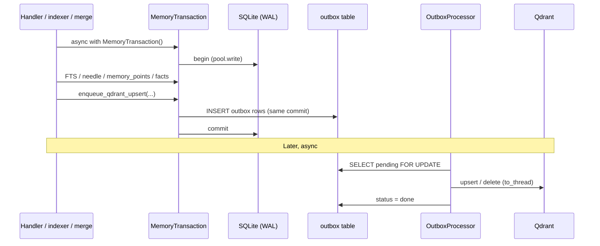
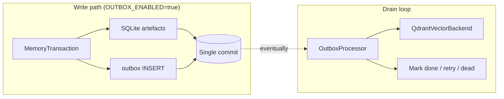
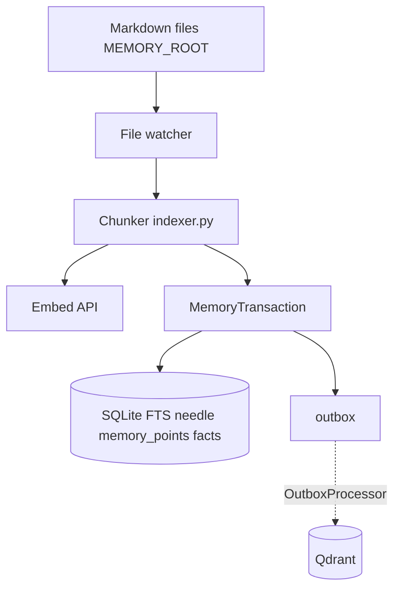

# Archivist architecture

## Overview

Archivist is a memory service for multi-agent fleets. It combines:

| Layer | Technology | Role |
|-------|------------|------|
| **Vectors** | Qdrant | Semantic search over hierarchical chunks |
| **Structured state** | SQLite (default) or PostgreSQL (`GRAPH_BACKEND=postgres`) | Knowledge graph, FTS, needle registry, audit, trajectories, skills, outbox |
| **Durability boundary** | Transactional outbox + `MemoryTransaction` | Atomic commit of graph/FTS artefacts with queued Qdrant work (Phase 3 + 3.5) |
| **Source of truth (optional)** | File system | Markdown under `MEMORY_ROOT` for ingestion |

Retrieval uses the **RLM** (recursive layered memory) pipeline in `rlm_retriever.py`. Writes on hot paths use **`MemoryTransaction`** so FTS, needle rows, `memory_points`, entity/facts (where applicable), and outbox rows commit together when `OUTBOX_ENABLED=true`. The graph backend is selected at startup via `GRAPH_BACKEND` (`sqlite` default, `postgres` for production scale). See [`docs/rearchitect_storage_phase3.md`](rearchitect_storage_phase3.md) for the outbox design and [`docs/DOCKER.md`](DOCKER.md) for Postgres setup.

---

## Storage transaction model (Phase 3.5)

Qdrant and SQLite are different stores; true distributed transactions are not available. Archivist implements a **transactional outbox** in SQLite:

1. Application code enters **`async with MemoryTransaction()`**, which acquires **one** `pool.write()` lock and exposes `txn.conn`.
2. All SQLite mutations for that operation run on that connection—either raw SQL via `txn.execute` / `txn.executemany` / `txn.fetchall`, or via **shims** that forward to `graph.py` helpers with **`conn=txn.conn`** (`upsert_fts_chunk`, `register_needle_tokens`, `upsert_entity`, `add_fact`).
3. **`enqueue_qdrant_upsert`**, **`enqueue_qdrant_delete`**, etc. append to an in-memory list. They do **not** call Qdrant inside the transaction.
4. On successful exit, **`_flush_events()`** inserts one row per event into the **`outbox`** table in the **same** commit as the graph/FTS/needle writes.
5. If any exception propagates, the transaction rolls back: **no** partial SQLite state and **no** outbox rows.
6. A background **`OutboxProcessor`** drains `pending` rows, applies them to **`QdrantVectorBackend`** (idempotent), then marks rows done or dead after retries.

**Why `conn=` matters:** `pool.write()` is backed by a non-reentrant `asyncio.Lock`. Helpers that call `pool.write()` internally would deadlock if invoked from inside an open `MemoryTransaction`. Passing `conn=` avoids nested lock acquisition.

**Default:** `OUTBOX_ENABLED=false` keeps legacy behaviour: Qdrant writes run inline in handlers; enqueue methods are no-ops.

---

## Data flow

### Ingestion (file watcher → index)

When `OUTBOX_ENABLED=false`, the indexer still uses SQLite transaction boundaries where implemented; Qdrant upsert runs inline after SQLite work (same as pre–Phase 3 behaviour for that flag).

### Retrieval (RLM pipeline)

Query execution is unchanged at a high level: coarse vector search → BM25 fusion → graph augmentation → dedupe → decay → hotness → threshold → optional rerank → parent enrichment → optional LLM refinement/synthesis. See the README “How It Works” section for the stage list; detailed stage notes remain in historical release notes below.

---

## Module map (production layout)

Code lives under `src/archivist/`.

| Area | Modules |
|------|---------|
| **App** | `app/main.py`, `app/mcp_server.py`, `app/handlers/*.py` — MCP tools, REST, startup |
| **Storage** | `storage/graph.py`, `storage/sqlite_pool.py`, `storage/asyncpg_backend.py`, `storage/backend_factory.py`, `storage/fts_search.py`, `storage/transaction.py`, `storage/outbox.py`, `storage/backends.py`, `storage/collection_router.py`, `storage/backup_manager.py` |
| **Retrieval** | `retrieval/rlm_retriever.py`, `retrieval/graph_retrieval.py`, `retrieval/reranker.py`, `retrieval/context_packer.py`, `retrieval/context_api.py`, `retrieval/session_store.py`, `retrieval/retrieval_log.py` |
| **Write** | `write/indexer.py`, `write/chunking.py` |
| **Lifecycle** | `lifecycle/memory_lifecycle.py`, `lifecycle/merge.py`, `lifecycle/cascade.py`, `lifecycle/curator_queue.py` |
| **Features** | `features/embeddings.py`, `features/llm.py`, … |
| **Core** | `core/config.py`, `core/rbac.py`, `core/audit.py`, `core/metrics.py`, … |

---

## Storage schema (summary)

### Qdrant payload fields

| Field | Type | Purpose |
|-------|------|---------|
| `agent_id` | keyword | Source agent |
| `file_path` | keyword | Relative path from MEMORY_ROOT |
| `file_type` | keyword | daily, durable, system, explicit, merged |
| `team` | keyword | Agent's team |
| `date` | keyword | ISO date |
| `namespace` | keyword | RBAC namespace |
| `text` | text | Chunk content (L2) |
| `l0`, `l1` | text | Tiered summaries |
| `chunk_index` | integer | Position in source file |
| `parent_id` | keyword | Parent chunk reference |
| `is_parent` | bool | Parent/child flag |
| `version` | integer | Monotonic version |
| `importance_score` | float | 0.0–1.0 retention score |
| `ttl_expires_at` | integer | Unix timestamp for expiry |
| `checksum` | keyword | Content hash for dedup |

Additional fields (`source_memory_id`, `is_reverse_hyde`, `thought_type`, actor provenance, etc.) are documented in [`docs/REFERENCE.md`](REFERENCE.md) and storage skills.

### SQLite / PostgreSQL (representative)

- **Graph** — `entities`, `relationships`, `facts`
- **Search** — `memory_chunks` (and FTS5 / `tsvector` virtual tables / GIN indexes), `needle_registry`
- **Routing** — `memory_points` (primary / micro_chunk / reverse_hyde linkage)
- **Outbox** — `outbox` (`id`, `event_type`, `payload`, `status`, `retry_count`, …)
- **Operations** — `audit_log`, `memory_versions`, `curator_queue`, `retrieval_logs`, `trajectories`, `skills`, …

Full table inventory: see the Archivist storage-schema skill (`.cursor/skills/archivist-storage-schema/SKILL.md`) when working on schema changes. Postgres DDL: [`storage/schema_postgres.sql`](../src/archivist/storage/schema_postgres.sql).

---

## Answer Finder (v2.3)

The v2.3 Answer Finder architecture adds precision and token efficiency on top of the base RLM pipeline.

### Tiered memory schema

`memory_chunks` now carries four new columns written at index time:

| Column | Type | Purpose |
|--------|------|---------|
| `importance` | REAL (0–1) | Retention priority; influences FTS rank boost |
| `tier_label` | TEXT | `l0` / `l1` / `l2` / `ephemeral` |
| `ttl_at` | TEXT | Optional ISO expiry; soft-filtered on retrieval |
| `decay_rate` | REAL | Per-chunk decay scalar (0 = no decay) |

`memory_hotness` gains `importance_signal` (blended frequency × recency × importance).

### Context packing (`context_packer.py`)

After the RLM pipeline returns results, `pack_context()` applies one of three policies against a `max_tokens` budget:

| Policy | Behaviour |
|--------|-----------|
| `adaptive` (default) | L0/L1 summaries fill `CONTEXT_L0_BUDGET_SHARE` of budget; remaining tokens go to L2 full chunks |
| `l0_first` | Prioritise abstract summaries; fall back to L2 when budget remains |
| `l2_first` | Full chunks first; L0/L1 fill remainder |

The result is a `PackedContext` dataclass with `total_tokens`, `naive_tokens`, `over_budget`, `tier_distribution`, and `token_savings_pct`.

### High-level API (`context_api.py`)

`get_relevant_context(agent_id, task_description, max_tokens, ...)` is the new canonical entry point for agents. It:

1. Runs the full RLM pipeline with `pack_context`
2. Merges in top knowledge-graph facts and procedural tips
3. Returns a `RelevantContext` with structured `ContextChunk` list and provenance

`create_handoff_packet` / `receive_handoff_packet` implement the multi-agent handoff protocol.

### Ephemeral tier (`session_store.py`)

`SessionStore` is an in-process, TTL-scoped store for within-session context. On `archivist_session_end`, promoted entries are persisted to durable memory. Config: `SESSION_STORE_MAX_ENTRIES`, `SESSION_STORE_TTL_SECONDS`.

### Token savings observability

`retrieval_logs` gains four columns (`tokens_returned`, `tokens_naive`, `savings_pct`, `pack_policy`). `_migrate_schema()` adds them to existing SQLite databases on first boot. `archivist_savings_dashboard` exposes aggregate stats and a hotness heatmap.

---

## Further reading

| Document | Content |
|----------|---------|
| [`rearchitect_storage_phase3.md`](rearchitect_storage_phase3.md) | Outbox design, failure modes, config, tests |
| [`DOCKER.md`](DOCKER.md) | Postgres backend quickstart, Answer Finder config, benchmark instructions |
| [`QA.md`](QA.md) | Test commands including `tests/qa/`, Postgres integration, token efficiency benchmarks |
| [`ROADMAP.md`](ROADMAP.md) | Product direction |

---

## Historical operational notes

The following sections record behaviour and operational guidance by release (condensed from earlier architecture docs). New deployments should rely on the storage transaction model above for cross-store write semantics when `OUTBOX_ENABLED=true`.

### v0.4.0

- **HTTP auth** — Set `ARCHIVIST_API_KEY`; clients send `Authorization: Bearer <key>` or `X-API-Key`. `GET /health` is never authenticated (Kubernetes probes).
- **SQLite writes** — Graph mutations, audit inserts, version inserts, and curator fact decay take a process-wide write lock (legacy `GRAPH_WRITE_LOCK`; production uses `sqlite_pool` with async lock).
- **Retrieval trace** — `archivist_search` JSON includes `retrieval_trace`: coarse hit counts, dedupe/threshold/rerank stages, and rerank settings.
- **Store conflicts** — Before `archivist_store`, optional Qdrant similarity vs *other* agents in the same namespace; block or allow via env + `force_skip_conflict_check`.
- **Explicit store IDs** — Qdrant point IDs for explicit stores are UUIDs (not content hashes).

### v0.5.0

- **Tiered context** — On ingest, parent chunks get auto-generated L0 and L1 summaries via LLM. Controlled by `TIERED_CONTEXT_ENABLED`.
- **Graph-augmented retrieval** — Entity mentions matched against the knowledge graph; facts merged into vector results with `GRAPH_RETRIEVAL_WEIGHT`.
- **Temporal decay** — Results weighted by recency; `TEMPORAL_DECAY_HALFLIFE_DAYS=0` disables.
- **Context budget** — `max_tokens`, `tier` (l0/l1/l2).
- **Progressive dereference** — `archivist_deref` for L2 drill-down.
- **Compressed index** — `archivist_index` navigational summary.
- **Contradiction surfacing** — `archivist_contradictions`.
- **Date range filters** — `date_from` / `date_to` on search.

### v0.6.0

- **Trajectory logging** — `archivist_log_trajectory`, outcome-aware retrieval, annotations, ratings, tips, `archivist_session_end`.

### v0.7.0

- **Skill registry** — SQLite tables for skills, versions, lessons, events; skill MCP tools.

### v0.8.0

- **Three-layer hierarchy** — Session → hot cache → long-term (Qdrant + SQLite).
- **`archivist://` URIs** — Parse and resolve.
- **Retrieval trajectory logging** — `retrieval_logs` SQLite table.
- **Consistency config** — `DEFAULT_CONSISTENCY` env var.

### v0.9.0

- **Prometheus metrics** — `GET /metrics`.
- **Webhooks** — HTTP POST on `memory_store`, `memory_conflict`, `skill_event`.
- **Health dashboard** — Aggregated stats and batch heuristic.

### v1.0.0

- **Write-ahead curator queue** — `curator_queue.py` enqueue/drain.
- **LLM-adjudicated dedup** — On store when similarity exceeds threshold.
- **Tip consolidation** — Trajectory tips clustered and merged.
- **`archivist_compress`** — Archives originals; structured summary option.
- **Hotness scoring** — Blended into RLM results.
- **Skill relation graph** — `skill_relations` table.

### v1.0.1

- **MCP server refactor** — Handlers split by domain under `app/handlers/`.
- **Background tasks** — Tracked with done callbacks.

### v1.1.0

- **Token counting** — `tokenizer.py` with tiktoken + fallback.
- **Context manager** — `context_manager.py` for budget checks.
- **Structured compaction** — `compaction.py` Goal/Progress/Decisions/Next Steps.
- **`archivist_context_check`** MCP tool.
- **`archivist_compress`** — `format` flat/structured, `previous_summary`.

### v2.3.0

- **Hierarchical memory schema** — `importance`, `tier_label`, `ttl_at`, `decay_rate` on `memory_chunks`; `importance_signal` on `memory_hotness`.
- **Context packing** — `context_packer.py` with `adaptive` / `l0_first` / `l2_first` policies; `over_budget` surfaced in RLM output.
- **Auto-compress** — Overflow content synthesised and re-injected when `AUTO_COMPRESS_ENABLED=true`.
- **Ephemeral tier** — `SessionStore` (`session_store.py`) with TTL and `archivist_session_end` flush.
- **High-level API** — `get_relevant_context()` in `context_api.py`; `RelevantContext`, `HandoffPacket`, `ContextChunk` dataclasses.
- **Multi-agent handoff** — `archivist_handoff` / `archivist_receive_handoff` MCP tools.
- **Token savings observability** — `retrieval_logs` extended with `tokens_returned`, `tokens_naive`, `savings_pct`, `pack_policy`; `archivist_savings_dashboard` MCP tool; hotness heatmap in dashboard.
- **Token efficiency benchmark** — `benchmarks/token_efficiency.py` with 49 queries across 3 packing policies.
