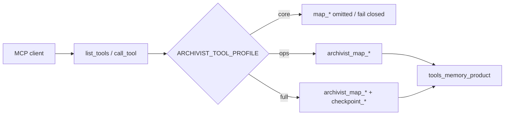
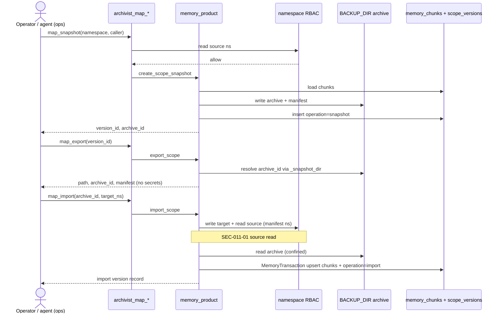
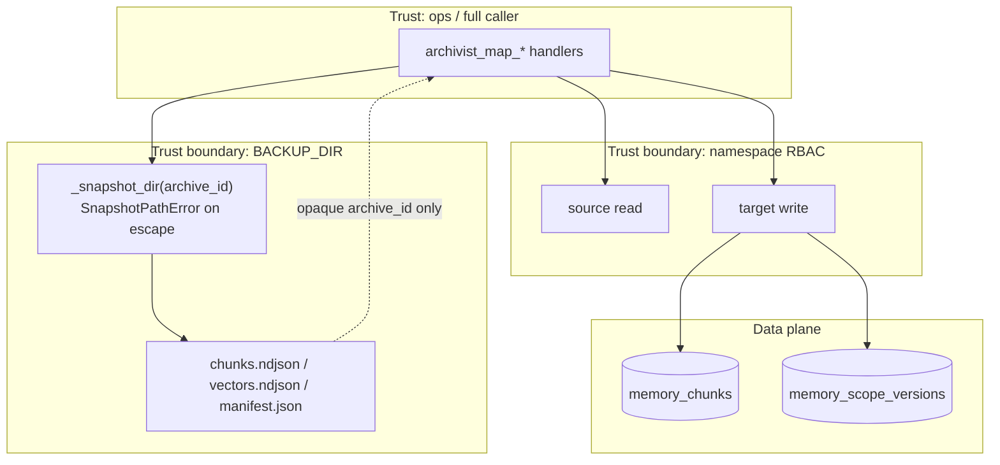
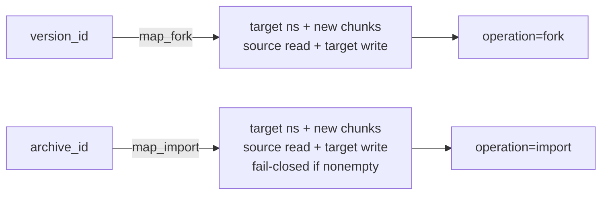

# ADR-011: Memory as a Product MCP + import (Diff #4 productize)

<!-- INIT-011/SPEC-001 -->

**Status:** Accepted
**Date:** 2026-07-27
**Deciders:** Archivist maintainers
**Source:** [BRAIN-005 — Complete Unique Differentiators](../../sdd/brainstorms/BRAIN-005-complete-unique-differentiators/decision-document.md);
→ service plumbing [INIT-001/SPEC-009](ADR-001-platform-coherence-sequencing.md) (`storage/memory_product.py`);
→ [INIT-011](../../sdd/initiatives/INIT-011-memory-as-product-mcp/INIT-011-memory-as-product-mcp-initiative.md);
→ prior: [ADR-010](ADR-010-intelligent-self-curation.md) (Diff #6 Done),
[ADR-009](ADR-009-native-multi-agent-coordination.md) (ops promotion pattern / GR-PROD-002).

## Decision

**Productize** Unique Differentiator **#4** (Memory as a Product) by exposing the
**existing** `memory_product` service (snapshot / fork / export + list/get) on
**ops** MCP as `archivist_map_*`, and adding a durable **import** round-trip —
finish the honest “Git for agent knowledge” claim **without** inventing a
parallel product stack, **without** net-new **core** MCP tools, and **without**
pulling Diff #6 / #7 / #8 or skill OS into this INIT.

### Plumbing vs Diff #4 product

| Layer | Meaning | Status entering INIT-011 |
|---|---|---|
| **MaP plumbing** | `storage/memory_product.py`: `create_scope_snapshot`, `fork_from_snapshot`, `export_scope`, `list_scope_versions`, `get_scope_version`; schema `memory_scope_versions`; archives under `BACKUP_DIR` via `_snapshot_dir` / `SnapshotPathError` | **Shipped** (INIT-001/SPEC-009) — **no MCP**, **no import** |
| **Differentiator #4 product** | First-class ops MCP + import round-trip + RBAC + tests + docs — honest ROADMAP “Done” | **This INIT** |

“Service helpers exist” is not Done. Diff #4 Done means an operator (or agent on
**ops** / **full**) can snapshot, fork, export, and **import** memory scopes as
first-class tools — not only call Python from a notebook.

### Product contract (INIT-011)

1. **MCP tools (locked names)** — Register on **ops** and **full** only:

   | MCP tool | Service API | Mutates? | RBAC |
   |---|---|---|---|
   | `archivist_map_list` | `list_scope_versions` | No | namespace **read** |
   | `archivist_map_get` | `get_scope_version` | No | namespace **read** (via record’s source ns) |
   | `archivist_map_snapshot` | `create_scope_snapshot` | Yes (version + archive) | namespace **read** (matches service today; write not required to snapshot) |
   | `archivist_map_fork` | `fork_from_snapshot` | Yes | source **read** + target **write** |
   | `archivist_map_export` | `export_scope` | Soft (lineage row) | namespace **read** |
   | `archivist_map_import` | **`import_scope`** (new, SPEC-002) | Yes | source **read** (manifest ns) + target **write** |

2. **Import semantics** — `import_scope` restores an archive identified by
   `archive_id` (opaque id resolved **only** via `_snapshot_dir` under
   `BACKUP_DIR`) into a **target** `namespace` (+ optional `agent_id` scope):
   - Manifest must be `kind=memory_scope` / supported `manifest_version`.
   - Caller must have namespace **read** on the archive’s **source** namespace
     (from manifest) **and** namespace **write** on the target (SEC-011-01;
     symmetric with fork). Missing source namespace in manifest fails closed.
   - Chunks always restored when present; vectors best-effort via existing
     `MemoryTransaction` / outbox when the archive includes them.
   - Inserts a `memory_scope_versions` row with `operation=import` and lineage
     pointing at `archive_id` / source version when known.
   - **Conflict policy (default):** fail closed with `MemoryProductConflictError`
     if the target agent scope is already non-empty in a way that would merge
     silently; operators may fork into a fresh target scope instead. (SPEC-002
     may expose an explicit ADR-amended overwrite flag later; not required for
     Diff #4 Done. Concurrent import TOCTOU tracked as SEC-011-02 Medium.)

3. **Profiles (GR-PROD-002)** — `archivist_map_*` visible/callable on **ops** and
   **full**; **zero** map tools on **core**. Do **not** add `archivist_map_` to
   `_OPS_HIDDEN_PREFIXES`. Checkpoint tools remain full-only (unrelated; leave
   `_OPS_HIDDEN_PREFIXES` checkpoint entry as-is).

4. **Path confinement (GR-PATH-001)** — All archive I/O reuses
   `backup_manager._snapshot_dir` / `SnapshotPathError`. Client-supplied paths
   that escape `BACKUP_DIR` (including `..`, absolute paths, symlink escapes)
   **must** fail closed. MCP handlers pass opaque `archive_id` / `version_id`,
   not host filesystem paths.

5. **Size / blast-radius caps** — Import (and preferably snapshot/export when
   cheap) enforce:

   | Cap | Default (SPEC-002 may add config knobs) | Notes |
   |---|---|---|
   | Max chunks per import | `50_000` | Reject oversized manifests / chunk payloads |
   | Max archive payload bytes | `256 * 1024 * 1024` (256 MiB) | Sum of archive files read for restore |
   | Version list limit | existing `list_scope_versions(limit=…)` | Keep service default ≤50 unless caller raises |

   Archive **retention** continues to follow `BACKUP_RETENTION_COUNT` /
   backup_manager prune semantics for operator backups; MaP does not invent a
   second retention root.

6. **Audit** — Mutating map ops (snapshot, fork, export lineage, import) emit
   structured logs / audit with tool name, `caller_agent_id`, namespace ids,
   `version_id`, `archive_id`, and paths under `BACKUP_DIR` **only**. **Never**
   log chunk body text or secret-bearing manifest keys (`_strip_secrets`).

7. **Schema** — Prefer **no** DDL. Lineage uses existing `memory_scope_versions`
   + `operation=import`. New columns only if proven necessary (`db_migration`
   HITL).

### Frozen guardrails

| ID | Rule |
|---|---|
| **GR-DIFF4-001** | Diff #4 = **productize** MaP service via MCP + import — not a parallel memory product. |
| **GR-PROD-002** | **No net-new core MCP tools**; map tools on ops/full only. |
| **GR-PATH-001** | Archives confined to `BACKUP_DIR`; reuse `SnapshotPathError`. |
| **GR-WEDGE-001** | Diff #4 only — no Diff #6 revisits, no checkpoint ops (#7), no UI billboard (#8). |
| **GR-LAYER-001** | Memory layer only — no skill OS (ADR-007/008). |
| **GR-TIER-001** | **No** institutional tier / Phase 7 multi-tier DDL this INIT. |
| **GR-SCHEMA-001** | Prefer no DROP; DDL only with HITL if import lineage cannot fit. |
| **GR-CE-001** / **GR-COACH-001** (carry) | Cite-or-refuse; `-m coach_core` / `agentic_memory` green. |

### Diff #4 Done criteria (ROADMAP claim)

Diff #4 may be marked **Done** only when all hold:

1. ADR-011 Accepted (this doc).
2. `import_scope` implemented + tested (INIT-011 SPEC-002).
3. `archivist_map_*` registered; ops/full expose; core excludes (SPEC-003).
4. Round-trip tests: snapshot → export → import (and fork) green; profile/RBAC
   coverage (SPEC-004).
5. REFERENCE / CHANGELOG / ROADMAP #4 → Done; Immediate Next → INIT-012 (SPEC-005).
6. Security Review: 0 unresolved Critical/High (SPEC-006).
7. Architecture Mermaid for MaP MCP + import (SPEC-007).
8. `-m coach_core` and `-m agentic_memory` green.

### Success spirit (INIT-011 SMs)

| ID | Spirit |
|---|---|
| **SM-001** | ADR-011 Accepted; Diff #4 Done criteria explicit. |
| **SM-002** | Ops can snapshot/fork/export/**import** via MCP with tests. |
| **SM-003** | Core profile has zero `archivist_map_*`; ops/full expose them. |
| **SM-004** | Marker suites green. |
| **SM-005** | Security Review pass. |
| **SM-006** | ROADMAP #4 → Done; Immediate Next → INIT-012. |

## Context

INIT-001/SPEC-009 shipped Memory-as-Product **service** helpers and
`memory_scope_versions`, but ROADMAP Diff #4 stayed Partial: no MCP surface and
no import round-trip. After INIT-010 (Diff #6 Done, PR #59), BRAIN-005 Phase 2
is INIT-011 — productize MaP the same way INIT-009 productized share coordination
(ops promotion, not core growth).

Without this ADR, SPEC-002…005 would re-open: tool naming; whether import belongs
in service vs MCP-only; whether core may see map tools; whether checkpoint hide
list should change; whether DDL is required.

## Alternatives considered

| Option | Description | Why not chosen |
|---|---|---|
| **Docs-only Diff #4 Done** | Mark Done on service helpers alone | Dishonest vs product bar |
| **Core map tools** | Put snapshot/import on coach core | Violates GR-PROD-002; core budget |
| **Rename to `archivist_memory_product_*`** | Longer prefix | Prefer short `archivist_map_*` (aud-1) |
| **Import = fork only** | Skip archive restore | Breaks export→import portability |
| **Pull checkpoint / UI / curator** | Multi-diff mega INIT | Violates GR-WEDGE-001 |
| **Institutional tier now** | Phase 7 DDL | GR-TIER-001; INIT-012 |
| **Client absolute paths** | Allow `path=` outside BACKUP_DIR | Violates GR-PATH-001 |

## Consequences

**Positive:**

- Honest Diff #4 / “Git for agent knowledge” storytelling.
- Operators get a clear ops MCP surface symmetric with `share_*` promotion.
- SPEC-002/003 have a frozen contract (names, RBAC, path, caps).

**Negative / accepted trade-offs:**

- Import fail-closed on non-empty target may require an extra fork into a fresh
  scope — safer than silent merge.
- Map tools need `ARCHIVIST_TOOL_PROFILE=ops` or `full` — core coaches stay lean.
- Size caps may reject huge fleets until operators raise knobs (SPEC-002).

## Threat framing (for SPEC-002/003/006)

| Threat | Control |
|---|---|
| Path traversal / archive escape | `_snapshot_dir` + `SnapshotPathError`; opaque ids only |
| Cross-namespace write via import/fork | Namespace RBAC **write** on target |
| Cross-namespace **read** via import (SEC-011-01) | Namespace RBAC **read** on archive source ns (manifest) before restore |
| Core elevation | Profile gate; map not in `CORE_TOOL_NAMES` |
| Archive bomb / DoS | Chunk + byte caps on import |
| Secret / content leak in logs | `_strip_secrets`; audit IDs/paths only |

## Non-goals (INIT-011)

- Net-new **core** MCP tools
- Skill registry / skill OS
- Institutional tier DDL / Phase 7 taxonomy
- Diff #6 curator changes, Diff #7 checkpoint ops/HITL/branch UX, Diff #8 UI billboard
- Changing `_OPS_HIDDEN_PREFIXES` for checkpoints
- Replacing Answer Finder packing, handoff, or share coordination

## References

- Service: `src/archivist/storage/memory_product.py`
- Path guards: `src/archivist/storage/backup_manager.py` (`_snapshot_dir`, `SnapshotPathError`)
- Profiles: `src/archivist/app/handlers/_registry.py` (`CORE_TOOL_NAMES`, `_OPS_HIDDEN_PREFIXES`)
- Config: `BACKUP_DIR`, `BACKUP_RETENTION_COUNT` in `src/archivist/core/config.py`
- ROADMAP Unique Differentiator #4
- BRAIN-005 completion program → next INIT-012 after Mode E
- Architecture diagrams: appendix below (INIT-011/SPEC-007); also
  [`sdd/initiatives/INIT-011-memory-as-product-mcp/design/INIT-011-architecture.md`](../../sdd/initiatives/INIT-011-memory-as-product-mcp/design/INIT-011-architecture.md)

---

## Appendix — Architecture diagrams (INIT-011/SPEC-007)

<!-- INIT-011/SPEC-007 -->

### A. Profile gating (core vs ops vs full)

| Profile | `archivist_map_*` | Notes |
|---------|-------------------|-------|
| **core** | Hidden / dispatch fail-closed | Coach ≤12; GR-PROD-002 |
| **ops** | Visible | Checkpoint tools still full-only |
| **full** | Visible | Entire registry |

### B. Snapshot → export → import sequence

### C. Trust boundaries (RBAC + BACKUP_DIR)

### D. Fork vs import (lineage)

