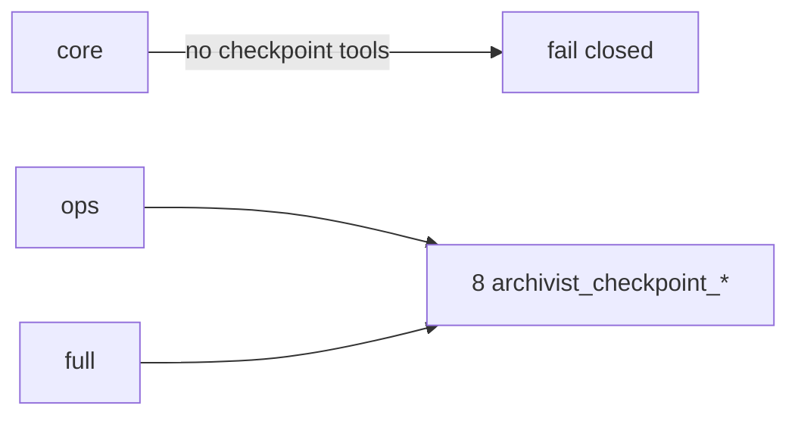
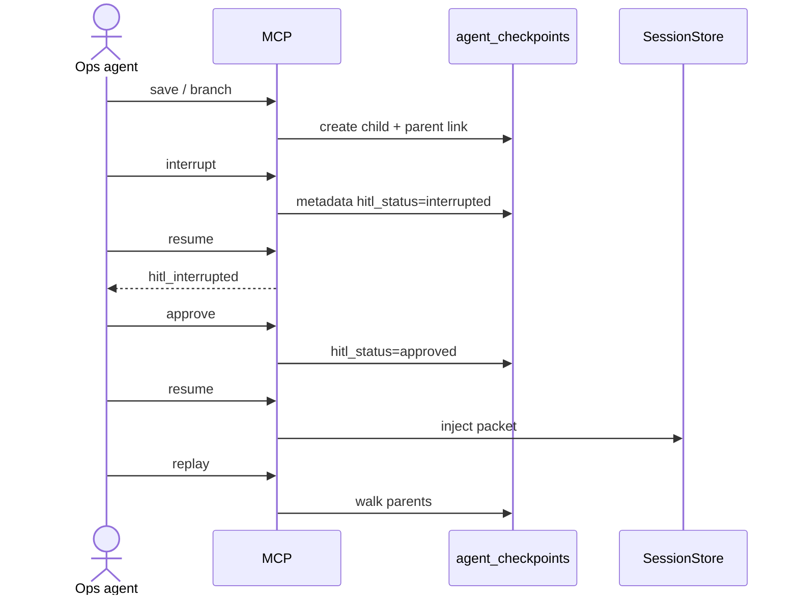

# ADR-012: Checkpoint ops promotion + branch + HITL (Diff #7 productize)

<!-- INIT-012/SPEC-001 -->

**Status:** Accepted
**Date:** 2026-07-27
**Deciders:** Archivist maintainers
**Source:** [BRAIN-005 — Complete Unique Differentiators](../../sdd/brainstorms/BRAIN-005-complete-unique-differentiators/decision-document.md)
(Phase 3); → plumbing [INIT-001/SPEC-007–008](ADR-001-platform-coherence-sequencing.md)
(`storage/checkpoints.py`, `tools_checkpoint.py`); →
[INIT-012](../../sdd/initiatives/INIT-012-checkpoint-time-travel/INIT-012-checkpoint-time-travel-initiative.md);
→ prior: [ADR-011](ADR-011-memory-as-product-mcp.md) (Diff #4 Done; left checkpoints full-only),
[ADR-009](ADR-009-native-multi-agent-coordination.md) (ops promotion pattern / GR-PROD-002),
[ADR-001](ADR-001-platform-coherence-sequencing.md) (agent-state ≠ L0–L2).

## Decision

**Productize** Unique Differentiator **#7** (Full Checkpointing + Time-Travel) by promoting
the **existing** `archivist_checkpoint_*` MCP surface from **full-only** to **ops**, adding an
explicit **branch** tool, and a thin **HITL interrupt → approve** loop — finish an honest
LangGraph-style resume / replay / branch claim **without** embedding a LangGraph (or other)
orchestration runtime, **without** net-new **core** MCP tools, and **without** institutional
tier / Phase 7 multi-tier DDL in this INIT.

### Plumbing vs Diff #7 product

| Layer | Meaning | Status entering INIT-012 |
|---|---|---|
| **Checkpoint plumbing** | Schema `agent_checkpoints`; store `create` / `get` / `list` / `link_parent`; MCP save/list/get/resume/replay on **full** only (`_OPS_HIDDEN_PREFIXES`); resume owner-agent bind (SEC-008-01); replay walks `parent_checkpoint_id` | **Shipped** (INIT-001/SPEC-007+008) |
| **Differentiator #7 product** | Ops-visible tools + explicit branch UX + thin HITL + tests + docs — honest ROADMAP “Done” under this ADR’s scope | **This INIT** |

“Checkpoint MCP exists on full” is not Diff #7 Done. Done means an operator (or agent on
**ops** / **full**) can save, list, get, resume, replay, **branch**, and run a **HITL
interrupt → approve** gate as first-class tools — with **core** still free of checkpoint tools.

### Product contract (INIT-012)

1. **Existing MCP tools (unchanged names)** — Keep and **promote** to **ops** + **full**:

   | MCP tool | Behavior | Mutates? | Authz |
   |---|---|---|---|
   | `archivist_checkpoint_save` | Persist payload; optional `parent_checkpoint_id` | Yes | namespace **write**; owner `agent_id` |
   | `archivist_checkpoint_list` | List by session | No | namespace **read** |
   | `archivist_checkpoint_get` | Get one by id | No | namespace **read** |
   | `archivist_checkpoint_resume` | Inject resume packet into caller SessionStore | Soft (session only) | namespace **read** + **owner-agent bind** (SEC-008-01) |
   | `archivist_checkpoint_replay` | Read-only parent chain walk | No | namespace **read** |

2. **New MCP tools (locked names)** — Register on **ops** and **full** only:

   | MCP tool | Service semantics | Mutates? | Authz |
   |---|---|---|---|
   | `archivist_checkpoint_branch` | Create a **child** checkpoint from a **required** parent in the same namespace (wraps create + parent link; may copy or accept a new payload per SPEC-002) | Yes | namespace **write** + **owner-agent bind** to parent’s `agent_id` (same agent owns the branch unless ADR-amended later — default: branch stays with parent owner) |
   | `archivist_checkpoint_interrupt` | Mark a checkpoint (or its session leaf) as **HITL waiting** via **metadata** (`hitl_status=interrupted`, reason, actor, timestamps) | Yes (metadata) | namespace **write** + owner-agent bind |
   | `archivist_checkpoint_approve` | Clear interrupt (`hitl_status=approved` / cleared waiting); required before **resume** when interrupted | Yes (metadata) | namespace **write** + owner-agent bind (approver may be same agent or documented delegate via `caller_agent_id` + RBAC — SPEC-002 must not weaken owner bind on the checkpoint record itself) |

3. **HITL loop (thin — GR-HITL-001)**

   ```text
   save / branch ──▶ interrupt ──▶ (human / operator) ──▶ approve ──▶ resume
                                      ▲
                                      └── replay remains read-only anytime
   ```

   - **Storage:** Prefer **metadata-only** on the existing `agent_checkpoints.metadata` JSON
     (no DDL). Keys (normative for SPEC-002): `hitl_status` ∈
     `{none|interrupted|approved}`, optional `hitl_reason`, `hitl_interrupted_at`,
     `hitl_approved_at`, `hitl_actor`.
   - **Resume gate:** If `hitl_status=interrupted`, `archivist_checkpoint_resume` **must**
     fail closed until `approve` clears the waiting state. `approved` / `none` allow resume.
   - **Not in scope:** LangGraph interrupt channels, external workflow engines, UI approve
     consoles (Diff #8), multi-party consensus voting.

4. **Branch UX**

   - Explicit `archivist_checkpoint_branch` — do **not** rely on operators remembering optional
     `parent_checkpoint_id` on save alone for the product claim.
   - Parent must exist in the **same namespace**; missing / cross-namespace parent → fail closed.
   - Replay continues to walk `parent_checkpoint_id` (branch creates a fork in the tree via a
     new child; linear save+parent remains valid for non-branch chains).

5. **Profiles (GR-PROD-002)**

   - Remove `archivist_checkpoint_` from `_OPS_HIDDEN_PREFIXES` (SPEC-003).
   - All `archivist_checkpoint_*` tools visible/callable on **ops** and **full**.
   - **Zero** `archivist_checkpoint_*` on **core** (fail closed).
   - MaP / share prefixes unchanged.

6. **Owner-agent bind & audit**

   - Branch, interrupt, approve, and resume **must** preserve SEC-008-01 parity: namespace
     RBAC alone is not enough to mutate or resume another agent’s checkpoint.
   - Structured logs / audit: tool name, `caller_agent_id`, `agent_id`, `namespace`,
     `checkpoint_id`, `parent_checkpoint_id`, `hitl_status` — **never** log full checkpoint
     **payload** bodies or secret-bearing metadata values.

7. **Schema / institutional tier**

   - **Institutional tier DDL: OUT** of INIT-012 (GR-TIER-001). No new tier labels / tables for
     Phase 7 multi-tier memory in this INIT.
   - Prefer **no** `agent_checkpoints` DDL. New columns only if SPEC-002 proves metadata
     insufficient (`db_migration` HITL gate). Payload size caps remain
     (`_MAX_PAYLOAD_BYTES` / `_MAX_METADATA_BYTES` / `_MAX_REPLAY_DEPTH`).

### Frozen guardrails

| ID | Rule |
|---|---|
| **GR-DIFF7-001** | Diff #7 = **productize** existing checkpoint store/MCP (ops + branch + thin HITL) — not a parallel checkpoint stack or orchestration runtime. |
| **GR-PROD-002** | **No net-new core MCP tools**; checkpoint tools on ops/full only. |
| **GR-HITL-001** | Thin interrupt → approve via metadata; not a full HITL / LangGraph engine. |
| **GR-LAYER-001** | Agent-state checkpoints ≠ L0–L2 memory tiers (ADR-001 GR-002). |
| **GR-TIER-001** | **No** institutional tier / Phase 7 multi-tier DDL this INIT. |
| **GR-WEDGE-001** | Diff #7 only — no Diff #8 billboard, no MaP revisits, no skill OS (ADR-007/008). |
| **GR-SCHEMA-001** | Prefer no DROP; DDL only with HITL if metadata cannot express HITL state. |
| **GR-CE-001** / **GR-COACH-001** (carry) | Cite-or-refuse; `-m coach_core` / `agentic_memory` green. |

### Diff #7 Done criteria (ROADMAP claim)

Diff #7 may be marked **Done** only when all hold:

1. ADR-012 Accepted (this doc).
2. Branch + HITL service helpers implemented + tested (INIT-012 SPEC-002).
3. Ops promotion + `archivist_checkpoint_branch|interrupt|approve` registered; ops/full expose;
   core excludes (SPEC-003).
4. Tests: resume/replay/branch/HITL + profile/RBAC green (SPEC-004); markers
   `coach_core` / `agentic_memory` green.
5. REFERENCE / CHANGELOG / ROADMAP #7 → **Done (scoped)**; Immediate Next → INIT-013
   (SPEC-005). Explicit honesty: **institutional tier / Phase 7 multi-tier DDL remains
   deferred** — do **not** check Phase 7 tracking as fully complete solely because Diff #7
   productize landed.
6. Security Review: 0 unresolved Critical/High (SPEC-006).
7. Architecture Mermaid for branch/HITL + profile matrix (SPEC-007).

**Out of Diff #7 Done (deferred / other INITs):** institutional tier DDL; Diff #8 observability
UI; skill OS; core profile checkpoint tools; embedding a LangGraph runtime.

## Context

ROADMAP Diff #7 was corrected from “Not started” to **Partial** (BRAIN-005 hygiene): resume and
replay already ship on **full**. Operators still cannot use checkpoints under the default
**ops** profile; branching is only an optional parent id on save; there is no interrupt/approve
gate. INIT-012 closes that product gap under a single ADR so SPEC-002/003 do not invent
conflicting shapes.

Agent-state checkpoints remain distinct from Memory-as-a-Product scope versions (ADR-011) and
from L0–L2 memory tiers.

## Alternatives considered

| Option | Verdict | Why |
|---|---|---|
| A. Leave checkpoints full-only; document as Done | **Reject** | ROADMAP/BRAIN-005 require ops promotion for honest Done |
| B. Promote to ops only; skip branch + HITL | **Reject** | Leaves Diff #7 Partial on UX claimed by differentiator |
| C. Embed LangGraph / full interrupt channels | **Reject** | Scope explosion; GR-HITL-001; Archivist is memory/agent-state, not the orchestrator |
| D. Institutional tier DDL inside INIT-012 | **Reject (default)** | GR-TIER-001; Phase 7 honesty — defer with explicit ROADMAP note |
| E. **Ops + branch tool + metadata HITL; tier OUT** | **Chosen** | Matches BRAIN-005 Phase 3; productizes existing store |

## Consequences

### Positive

- Ops agents get LangGraph-style resume/replay/branch + thin HITL without a second stack.
- Core coach surface stays small (GR-PROD-002).
- Clear Done bar with institutional tier honesty (no false Phase 7 complete claim).

### Negative / follow-ups

- Ops blast radius increases — Security Review (SPEC-006) must re-check owner bind and logging.
- Metadata HITL is weaker than a dedicated workflow table — acceptable under GR-HITL-001; revisit
  only if production proves metadata races (then `db_migration` HITL).
- Phase 7 “multi-tier memory” tracking remains open until a future INIT owns institutional tier.

### Spec mapping

| Spec | Implements |
|---|---|
| SPEC-001 | This ADR (Accepted) |
| SPEC-002 | Branch + HITL service helpers |
| SPEC-003 | Ops promotion + MCP tools |
| SPEC-004 | Tests / profiles |
| SPEC-005 | Docs + ROADMAP Diff #7 Done (scoped) |
| SPEC-006 | Security Review |
| SPEC-007 | Architecture diagrams |

## Security notes (for implementers)

- Preserve SEC-008-01 owner-agent bind on resume, branch, interrupt, and approve.
- Never log full payloads; audit ids and `hitl_status` only.
- Fail closed on cross-namespace parent, missing parent, and resume-while-interrupted.
- Core profile regression tests are mandatory (SPEC-004).

## References

- `src/archivist/storage/checkpoints.py`
- `src/archivist/app/handlers/tools_checkpoint.py`
- `src/archivist/app/handlers/_registry.py` (`_OPS_HIDDEN_PREFIXES`)
- ADR-001, ADR-009, ADR-011
- BRAIN-005 action-plan Phase 3

## Appendix — Architecture Mermaid (INIT-012/SPEC-007)

Agent-state checkpoints are **not** L0–L2 memory tiers.

### Profile visibility



### Branch + HITL flow


